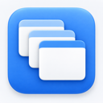

# Best Mac Apps (2026) — Native macOS Apps

  

Discover high-quality macOS apps built with native technologies (Swift, SwiftUI, AppKit) that are fast, efficient, and respect your Mac's resources. This list focuses on apps that feel like they belong on macOS — no Electron bloat, just pure native performance.

Maintained by [MacNative.io](https://macnative.io/?utm_source=github&utm_medium=referral&utm_campaign=native_apps_list&utm_content=readme_intro), a curated directory of Mac apps. Explore screenshots, pricing, and app details to find the right tools for your Mac.

## 📬 Get Monthly Native App Picks in Your Inbox

Subscribe to our newsletter and get 5-10 handpicked native macOS apps delivered monthly.

**What you'll get:**

- 🎯 Curated native apps (no Electron bloat)
- 💎 Hidden gems you won't find elsewhere
- 🆓 Free & open-source alternatives
- 📊 App comparisons & recommendations
- 🔧 Tips for getting the most out of your Mac

📖 **[Subscribe to the Newsletter →](https://nativemacapps.substack.com/)**

_Join early subscribers and never miss a great native Mac app again. Unsubscribe anytime._

**👨‍💻 Building a Mac app?** This list is for users discovering apps — if you're looking for where to *launch* one, see [Awesome Mac Launch Platforms](https://github.com/macnative/awesome-mac-launch-platforms) for submission platforms, subreddits, and newsletters, each tagged free or paid.

---

## Contents

**Getting Started**
- [What Makes an App "Native"?](#what-makes-an-app-native)
- [New to Mac? Start Here](#-new-to-mac-start-here)

**Categories**
- 🤖 [AI Tools](#ai-tools)
- 📊 [Analytics & Monitoring](#analytics--monitoring)
- 🎵 [Audio & Music](#audio--music)
- 💾 [Backup & Sync](#backup--sync)
- 🌐 [Browsers & Web](#browsers--web)
- 📅 [Calendar & Time](#calendar--time)
- 📋 [Clipboard Managers](#clipboard-managers)
- 🎨 [Color Pickers](#color-pickers)
- 🗄️ [Database Tools](#database-tools)
- 🖌️ [Design Tools](#design-tools)
- 👨‍💻 [Developer Tools](#developer-tools)
- ✉️ [Email & Communication](#email--communication)
- 💰 [Finance](#finance)
- 🗂️ [File Management](#file-management)
- 🔀 [Git & Version Control](#git--version-control)
- 🖼️ [Image & Graphics](#image--graphics)
- 📝 [Markdown Editors](#markdown-editors)
- 📌 [Menu Bar Apps](#menu-bar-apps)
- 📡 [Network Tools](#network-tools)
- 🗒️ [Note-Taking & Writing](#note-taking--writing)
- 🔐 [Password Managers](#password-managers)
- 📄 [PDF Tools](#pdf-tools)
- ⚡ [Productivity](#productivity)
- 📸 [Screenshot & Recording](#screenshot--recording)
- 🛡️ [Security & Privacy](#security--privacy)
- 🛠️ [System Utilities](#system-utilities)
- 💻 [Terminal & Shell](#terminal--shell)
- ✍️ [Text Editors](#text-editors)
- 🎬 [Video & Media](#video--media)
- 🌄 [Wallpaper Apps](#wallpaper-apps)
- 🪟 [Window Management](#window-management)

**Resources**
- [Mac App Guides](#mac-app-guides)
- [Contributing](#contributing)
- [Star History](#star-history)
- [License](#license)

---

### What Makes an App "Native"?

Apps on this list are:

- ✅ Built with native macOS frameworks (Swift, SwiftUI, AppKit, Objective-C)
- ✅ Lightweight and resource-efficient
- ✅ Follow Apple's Human Interface Guidelines
- ✅ Feel fast and responsive
- ❌ NOT Electron or web-wrapper apps
- ❌ NOT resource-heavy cross-platform apps

---

## 🚀 New to Mac? Start Here

Not sure where to begin? These 6 apps are the most universally useful — install them first and thank yourself later.

<table>
<tr>
<td width="64"></td>
<td><strong><a href="https://rectangleapp.com/">Rectangle</a></strong> Snap windows into place with keyboard shortcuts. You'll use this every single day.</td>
</tr>
<tr>
<td width="64"></td>
<td><strong><a href="https://github.com/p0deje/Maccy">Maccy</a></strong> Clipboard history that just works. Never lose a copied item again.</td>
</tr>
<tr>
<td width="64"></td>
<td><strong><a href="https://iina.io/">IINA</a></strong> Plays any video format natively. Makes QuickTime feel like a toy.</td>
</tr>
<tr>
<td width="64"></td>
<td><strong><a href="https://mole.fit/">Mole</a></strong> Uninstall apps properly, clean caches, and reclaim disk space — all in one tool.</td>
</tr>
<tr>
<td width="64"></td>
<td><strong><a href="https://iterm2.com/">iTerm2</a></strong> The terminal macOS should have shipped with. Tabs, split panes, search, and more.</td>
</tr>
<tr>
<td width="64"></td>
<td><strong><a href="https://tinycast.dev/">TinyCast</a></strong> Supercharged Spotlight replacement. Launch apps, manage clipboard, run scripts, and more — all from one keystroke.</td>
</tr>
</table>

---

## AI Tools

[Browse AI and automation apps on MacNative →](https://macnative.io/categories/ai-automation?utm_source=github&utm_medium=referral&utm_campaign=native_apps_list&utm_content=category_ai-automation)

<!-- No entries yet — see CONTRIBUTING.md for how to add one. Keep entries alphabetical and native (no Electron AI wrappers). -->

<table>
</table>

## Analytics & Monitoring

<table>
<tr>
<td width="64"></td>
<td><strong><a href="https://bjango.com/mac/istatmenus/">iStat Menus</a></strong> Advanced Mac system monitor in your menu bar. <code>Paid</code></td>
</tr>
<tr>
<td width="64"></td>
<td><strong><a href="https://github.com/exelban/stats">Stats</a></strong> macOS system monitor for CPU, GPU, memory, disk, and more. <code>Free</code> <code>Open Source</code></td>
</tr>
<tr>
<td width="64"></td>
<td><strong><a href="https://usage.pro">Usage</a></strong> System activity monitor for macOS, iOS, and iPadOS. <code>Freemium</code></td>
</tr>
</table>

## Audio & Music

[Browse audio and voice apps on MacNative →](https://macnative.io/categories/audio-voice?utm_source=github&utm_medium=referral&utm_campaign=native_apps_list&utm_content=category_audio-voice)

<table>
<tr>
<td width="64"></td>
<td><strong><a href="https://github.com/kyleneideck/BackgroundMusic">BackgroundMusic</a></strong> macOS audio utility to control volume per-app. <code>Free</code> <code>Open Source</code></td>
</tr>
<tr>
<td width="64"></td>
<td><strong><a href="https://cog.losno.co/">Cog</a></strong> Audio player for macOS with broad format support. <code>Free</code> <code>Open Source</code></td>
</tr>
<tr>
<td width="64"></td>
<td><strong><a href="https://eqmac.app/">eqMac</a></strong> System-wide audio equalizer for macOS. <code>Free</code> <code>Open Source</code></td>
</tr>
<tr>
<td width="64"></td>
<td><strong><a href="https://iina.io/">IINA</a></strong> Modern video player with native macOS design. <code>Free</code> <code>Open Source</code></td>
</tr>
<tr>
<td width="64"></td>
<td><strong><a href="https://muxie.duhnnie.com">Muxie</a></strong> Last.fm scrobbler for Apple Music, Spotify Desktop, iPod Classic, Rockbox devices and some others. <code>Free</code></td>
</tr>
<tr>
<td width="64"></td>
<td><strong><a href="https://github.com/kushalpandya/Petrichor">Petrichor</a></strong> Offline music player with support for over 20 file formats and a lot of other features. <code>Free</code> <code>Open Source</code></td>
</tr>
<tr>
<td width="64"></td>
<td><strong><a href="https://roamfm.app/">Roam FM</a></strong> Roam the world through global radio. <code>Freemium</code></td>
</tr>
<tr>
<td width="64"></td>
<td><strong><a href="https://replay.software/sleeve">Sleeve</a></strong> Beautiful now playing display for Apple Music. <code>Paid</code></td>
</tr>
<tr>
<td width="64"></td>
<td><strong><a href="https://rogueamoeba.com/soundsource/">SoundSource</a></strong> Superior sound control for macOS. <code>Paid</code></td>
</tr>
</table>

## Backup & Sync

<table>
<tr>
<td width="64"></td>
<td><strong><a href="https://www.arqbackup.com/">Arq</a></strong> Backup your files to cloud storage. <code>Paid</code></td>
</tr>
<tr>
<td width="64"></td>
<td><strong><a href="https://bombich.com/">Carbon Copy Cloner</a></strong> Reliable Mac backup and cloning solution. <code>Paid</code></td>
</tr>
</table>

## Browsers & Web

<table>
<tr>
<td width="64"></td>
<td><strong><a href="https://browser.kagi.com/">Orion</a></strong> Lightweight WebKit browser with zero telemetry. <code>Free</code></td>
</tr>
<tr>
<td width="64"></td>
<td><strong><a href="https://zen-browser.app/">Zen Browser</a></strong> Privacy-focused, customizable browser built on Firefox. <code>Free</code> <code>Open Source</code></td>
</tr>
</table>

## Calendar & Time

<table>
<tr>
<td width="64"></td>
<td><strong><a href="https://flexibits.com/fantastical">Fantastical</a></strong> Calendar app with natural language input. <code>Subscription</code></td>
</tr>
<tr>
<td width="64"></td>
<td><strong><a href="https://horacal.app">hora Calendar</a></strong> Google Calendar client for macOS with API connection. <code>Suscription</code></td>
</tr>
<tr>
<td width="64"></td>
<td><strong><a href="https://www.mowglii.com/itsycal/">Itsycal</a></strong> Tiny menu bar calendar. <code>Free</code> <code>Open Source</code></td>
</tr>
<tr>
<td width="64"></td>
<td><strong><a href="https://github.com/leits/MeetingBar">Meeting Bar</a></strong> Menu bar app for your calendar meetings. <code>Free</code> <code>Open Source</code></td>
</tr>
</table>

## Clipboard Managers

<table>
<tr>
<td width="64"></td>
<td><strong><a href="https://github.com/p0deje/Maccy">Maccy</a></strong> Lightweight clipboard manager with search. <code>Free</code> <code>Open Source</code></td>
</tr>
<tr>
<td width="64"></td>
<td><strong><a href="https://fiplab.com/apps/copyclip-for-mac">CopyClip</a></strong> Lightweight clipboard history manager. <code>Free</code></td>
</tr>
<tr>
<td width="64"></td>
<td><strong><a href="https://pasteapp.io/">Paste</a></strong> Beautiful clipboard manager with cloud sync. <code>Subscription</code></td>
</tr>
<tr>
<td width="64"></td>
<td><strong><a href="https://github.com/momenbasel/pesty">Pesty</a></strong> Native clipboard manager with pinboards and keyboard-driven pasting. <code>Free</code> <code>Open Source</code></td>
</tr>
<tr>
<td width="64"></td>
<td><strong><a href="https://unclutterapp.com/">Unclutter</a></strong> Files, notes, and clipboard manager in one. <code>Paid</code></td>
</tr>
</table>

## Color Pickers

<table>
<tr>
<td width="64"></td>
<td><strong><a href="https://colorslurp.com/">ColorSlurp</a></strong> Best color picker and organizer for macOS. <code>Freemium</code></td>
</tr>
<tr>
<td width="64"></td>
<td><strong><a href="https://superhighfives.com/pika">Pika</a></strong> Beautiful color picker for macOS. <code>Free</code> <code>Open Source</code></td>
</tr>
<tr>
<td width="64"></td>
<td><strong><a href="https://sipapp.io/">Sip</a></strong> Collect, organize and share colors. <code>Paid</code></td>
</tr>
</table>

## Database Tools

<table>
<tr>
<td width="64"></td>
<td><strong><a href="https://eggerapps.at/postico2/">Postico</a></strong> Modern PostgreSQL client for macOS. <code>Paid</code> <code>EU</code></td>
</tr>
<tr>
<td width="64"></td>
<td><strong><a href="https://tableplus.com/">TablePlus</a></strong> Modern native database management tool. <code>Freemium</code></td>
</tr>
<tr>
<td width="64"></td>
<td><strong><a href="https://tablepro.app">TablePro</a></strong> Native database client for MySQL, PostgreSQL, SQLite, MongoDB, Redis, and more. <code>Free</code> <code>Open Source</code></td>
</tr>
</table>

## Design Tools

<table>
<tr>
<td width="64"></td>
<td><strong><a href="https://geticonjar.com/">IconJar</a></strong> Icon management tool for designers. <code>Paid</code></td>
</tr>
<tr>
<td width="64"></td>
<td><strong><a href="https://www.sketch.com/">Sketch</a></strong> Professional digital design for Mac. <code>Subscription</code> <code>EU</code></td>
</tr>
<tr>
<td width="64"></td>
<td><strong><a href="https://xscopeapp.com/">xScope</a></strong> Measure, inspect, and test on-screen graphics. <code>Paid</code></td>
</tr>
</table>

## Developer Tools

[Browse developer tools with screenshots and pricing on MacNative →](https://macnative.io/categories/developer-tools?utm_source=github&utm_medium=referral&utm_campaign=native_apps_list&utm_content=category_developer-tools)

<table>
<tr>
<td width="64"></td>
<td><strong><a href="https://bucketmate.app/">BucketMate</a></strong> Native S3 GUI Client for macOS <code>Freemium</code></td>
</tr>
<tr>
<td width="64"></td>
<td><strong><a href="https://github.com/CodeEditApp/CodeEdit">CodeEdit</a></strong> Native code editor for macOS. <code>Free</code> <code>Open Source</code></td>
</tr>
<tr>
<td width="64"></td>
<td><strong><a href="https://github.com/vashpan/xcode-dev-cleaner">DevCleaner</a></strong> Clean Xcode cache and derived data. <code>Free</code> <code>Open Source</code></td>
</tr>
<tr>
<td width="64"></td>
<td><strong><a href="https://devutils.com/">DevUtils</a></strong> All-in-one offline toolbox for developers (42+ tools). <code>Freemium</code></td>
</tr>
<tr>
<td width="64"></td>
<td><strong><a href="https://macsmith.app/">Macsmith</a></strong> GUI for CLI dev tools like Homebrew, mise, nvm, Colima, and local databases. <code>Freemium</code></td>
</tr>
<tr>
<td width="64"></td>
<td><strong><a href="https://paw.cloud/">Paw</a></strong> Advanced API tool for Mac. <code>Paid</code></td>
</tr>
<tr>
<td width="64"></td>
<td><strong><a href="https://proxyman.io/">Proxyman</a></strong> Native HTTP debugging proxy. <code>Freemium</code></td>
</tr>
<tr>
<td width="64"></td>
<td><strong><a href="https://www.rocketsim.app/">RocketSim</a></strong> Enhance Xcode Simulator productivity. <code>Freemium</code></td>
</tr>
<tr>
<td width="64"></td>
<td><strong><a href="https://rockxy.io">Rockxy</a></strong> macOS HTTP/HTTPS debugging proxy to capture, inspect, modify, and replay traffic. <code>Freemium</code> <code>Open Source</code></td>
</tr>
<tr>
<td width="64"></td>
<td><strong><a href="https://snipperapp.com">SnipperApp 3</a></strong> Code snippet manager with iCloud and Gist sync, and a bundled MCP server. <code>Paid (one-time)</code></td>
</tr>
<tr>
<td width="64"></td>
<td><strong><a href="https://github.com/Stmol/ssh-keys-manager-macos-app">SSH Keys Manager</a></strong> Native macOS app for managing SSH keys and SSH config entries. <code>Free</code> <code>Open Source</code></td>
</tr>
<tr>
<td width="64"></td>
<td><strong><a href="https://developer.apple.com/sf-symbols/">SF Symbols</a></strong> Browse and export Apple's SF Symbols. <code>Free</code></td>
</tr>
<tr>
<td width="64"></td>
<td><strong><a href="https://vibedock.dev/">Vibedock</a></strong> Manage Claude Code MCP servers from your macOS menu bar. <code>Paid (one-time)</code></td>
</tr>
</table>

## Email & Communication

<table>
<tr>
<td width="64"></td>
<td><strong><a href="https://airmailapp.com/">Airmail</a></strong> Lightning fast mail client for Mac. <code>Paid</code> <code>EU</code></td>
</tr>
<tr>
<td width="64"></td>
<td><strong><a href="https://freron.com/">MailMate</a></strong> Advanced IMAP email client with keyboard control. <code>Paid</code></td>
</tr>
<tr>
<td width="64"></td>
<td><strong><a href="https://mimestream.com/">Mimestream</a></strong> Native Gmail client for macOS. <code>Paid</code></td>
</tr>
</table>

## Finance

[Browse money & finance apps with screenshots and pricing on MacNative →](https://macnative.io/categories/money-finance?utm_source=github&utm_medium=referral&utm_campaign=native_apps_list&utm_content=category_money-finance)

<table>
<tr>
<td width="64"></td>
<td><strong><a href="https://chronicleapp.com/">Chronicle</a></strong> Bill organizer and payment tracker. <code>Paid</code></td>
</tr>
<tr>
<td width="64"></td>
<td><strong><a href="https://www.copilot.money/">Copilot</a></strong> Personal finance and budgeting app with automatic transaction syncing. <code>Subscription</code></td>
</tr>
<tr>
<td width="64"></td>
<td><strong><a href="https://soulver.app/">Soulver</a></strong> Smart notepad calculator that understands plain English math. <code>Paid</code> <code>EU</code></td>
</tr>
<tr>
<td width="64"></td>
<td><strong><a href="https://subsday.appps.od.ua/">Subscription Day</a></strong> Track your paid subscriptions and analyze spending statistics. <code>Freemium</code></td>
</tr>
</table>

## File Management

<table>
<tr>
<td width="64"></td>
<td><strong><a href="https://mac.eltima.com/file-manager.html">Commander One</a></strong> Dual-pane file manager for macOS. <code>Freemium</code></td>
</tr>
<tr>
<td width="64"></td>
<td><strong><a href="https://binarynights.com/">ForkLift</a></strong> Advanced dual-pane file manager and FTP client. <code>Paid</code></td>
</tr>
<tr>
<td width="64"></td>
<td><strong><a href="https://www.noodlesoft.com/">Hazel</a></strong> Automated organization for your Mac. <code>Paid</code></td>
</tr>
<tr>
<td width="64"></td>
<td><strong><a href="https://www.namequick.app">NameQuick</a></strong> AI-powered file renaming using GPT, Gemini, or local LLMs. <code>Paid</code></td>
</tr>
<tr>
<td width="64"></td>
<td><strong><a href="https://www.cocoatech.io/">Path Finder</a></strong> Powerful Finder alternative. <code>Paid</code></td>
</tr>
<tr>
<td width="64"></td>
<td><strong><a href="https://github.com/sindresorhus/quick-look-plugins">Quick Look plugins</a></strong> Useful Quick Look plugins for developers. <code>Free</code> <code>Open Source</code></td>
</tr>
<tr>
<td width="64"></td>
<td><strong><a href="https://macpaw.com/encrypto">Encrypto</a></strong> Encrypt files with AES-256 encryption. <code>Free</code></td>
</tr>
</table>

## Git & Version Control

<table>
<tr>
<td width="64"></td>
<td><strong><a href="https://git-fork.com/">Fork</a></strong> Fast and friendly Git client for Mac. <code>Free</code></td>
</tr>
<tr>
<td width="64"></td>
<td><strong><a href="https://www.gitfox.app/">GitFox</a></strong> Git client with a focus on simplicity. <code>Paid</code></td>
</tr>
<tr>
<td width="64"></td>
<td><strong><a href="https://gitup.co/">GitUp</a></strong> Git interface you've been missing. <code>Free</code> <code>Open Source</code></td>
</tr>
<tr>
<td width="64"></td>
<td><strong><a href="https://www.sourcetreeapp.com/">SourceTree</a></strong> Free Git client from Atlassian. <code>Free</code></td>
</tr>
<tr>
<td width="64"></td>
<td><strong><a href="https://www.git-tower.com/mac">Tower</a></strong> Powerful Git client for Mac. <code>Paid</code> <code>EU</code></td>
</tr>
</table>

## Image & Graphics

[Browse photo & video apps with screenshots and pricing on MacNative →](https://macnative.io/categories/photo-video?utm_source=github&utm_medium=referral&utm_campaign=native_apps_list&utm_content=category_photo-video)

<table>
<tr>
<td width="64"></td>
<td><strong><a href="https://flyingmeat.com/acorn/">Acorn</a></strong> Full-featured photo editor designed for humans. <code>Paid</code></td>
</tr>
<tr>
<td width="64"></td>
<td><strong><a href="https://imageoptim.com/">ImageOptim</a></strong> Compress images without losing quality. <code>Free</code> <code>Open Source</code></td>
</tr>
<tr>
<td width="64"></td>
<td><strong><a href="https://www.pixaveapp.com/">Pixave</a></strong> Ultimate image organizer and viewer. <code>Paid</code></td>
</tr>
<tr>
<td width="64"></td>
<td><strong><a href="https://www.pixelmator.com/pro/">Pixelmator Pro</a></strong> Powerful native image editor. <code>Paid</code> <code>EU</code></td>
</tr>
<tr>
<td width="64"></td>
<td><strong><a href="https://flyingmeat.com/retrobatch/">Retrobatch</a></strong> Batch image processing for Mac. <code>Paid</code></td>
</tr>
<tr>
<td width="64"></td>
<td><strong><a href="https://xscopeapp.com/">xScope</a></strong> Measure, inspect and test on-screen graphics. <code>Paid</code></td>
</tr>
</table>

## Markdown Editors

<table>
<tr>
<td width="64"></td>
<td><strong><a href="https://glance.md/">Glance</a></strong> Native Markdown viewer and Quick Look extension. <code>Free</code></td>
</tr>
<tr>
<td width="64"></td>
<td><strong><a href="https://ia.net/writer">iA Writer</a></strong> Focused writing app with beautiful typography. <code>Paid</code></td>
</tr>
<tr>
<td width="64"></td>
<td><strong><a href="https://macdown.uranusjr.com/">MacDown</a></strong> Open source Markdown editor for macOS. <code>Free</code> <code>Open Source</code></td>
</tr>
<tr>
<td width="64"></td>
<td><strong><a href="https://marked2app.com/">Marked 2</a></strong> Markdown preview and conversion. <code>Paid</code></td>
</tr>
<tr>
<td width="64"></td>
<td><strong><a href="https://vorojar.github.io/md-preview/">MD Preview</a></strong> Lightweight Markdown preview app using Rust and native WebView. <code>Free</code> <code>Open Source</code></td>
</tr>
<tr>
<td width="64"></td>
<td><strong><a href="https://www.mweb.im/">MWeb</a></strong> Pro Markdown writing and note-taking. <code>Paid</code></td>
</tr>
<tr>
<td width="64"></td>
<td><strong><a href="https://nicemd.app/">Nice.md</a></strong> Markdown viewer with Quick Look preview, outline sidebar, and optional edit mode. <code>Freemium</code> <code>EU</code></td>
</tr>
<tr>
<td width="64"></td>
<td><strong><a href="https://typora.io/">Typora</a></strong> Minimal Markdown editor and reader. <code>Paid</code></td>
</tr>
<tr>
<td width="64"></td>
<td><strong><a href="https://writer.computer/">Writer</a></strong> Local-first markdown editor with a Rust backend and native WKWebView. <code>Free</code> <code>Open Source</code></td>
</tr>
</table>

## Menu Bar Apps

<table>
<tr>
<td width="64"></td>
<td><strong><a href="https://www.macbartender.com/">Bartender</a></strong> Organize your menu bar icons. <code>Paid</code></td>
</tr>
<tr>
<td width="64"></td>
<td><strong><a href="https://commitments.pages.dev/">Commitments</a></strong> Your tasks in menu bar. <code>Paid</code></td>
</tr>
<tr>
<td width="64"></td>
<td><strong><a href="https://github.com/inderdhir/DatWeatherDoe">DatWeatherDoe</a></strong> Simple menu bar weather app. <code>Free</code> <code>Open Source</code></td>
</tr>
<tr>
<td width="64"></td>
<td><strong><a href="https://github.com/Mortennn/Dozer">Dozer</a></strong> Hide menu bar icons to give your Mac a cleaner look. <code>Free</code> <code>Open Source</code></td>
</tr>
<tr>
<td width="64"></td>
<td><strong><a href="https://www.dynamichorizon.app/">DynamicHorizon</a></strong> Shows media, notifications, timers, downloads, and controls around the Mac notch. <code>Paid</code></td>
</tr>
<tr>
<td width="64"></td>
<td><strong><a href="https://handmirror.app/">Hand Mirror</a></strong> One-click camera check from menu bar. <code>Free</code></td>
</tr>
<tr>
<td width="64"></td>
<td><strong><a href="https://github.com/patwalls/headroom">Headroom</a></strong> Live Claude Code session (5h) and weekly (7d) usage in your menu bar — zero network calls, reads what Claude Code already writes locally. <code>Free</code> <code>Open Source</code></td>
</tr>
<tr>
<td width="64"></td>
<td><strong><a href="https://github.com/dwarvesf/hidden">Hidden Bar</a></strong> Hide menu bar items. <code>Free</code> <code>Open Source</code></td>
</tr>
<tr>
<td width="64"></td>
<td><strong><a href="https://github.com/pedrovieira/Holeberry">Holeberry</a></strong> Monitor and control your Pi-hole instances from the menu bar. <code>Free</code> <code>Open Source</code></td>
</tr>
<tr>
<td width="64"></td>
<td><strong><a href="https://homebar.pro">HomeBar for Homey Pro</a></strong> Manage your Homey Pro smart home. <code>Freemium</code></td>
</tr>
<tr>
<td width="64"></td>
<td><strong><a href="https://www.mowglii.com/itsycal/">Itsycal</a></strong> Tiny menu bar calendar. <code>Free</code> <code>Open Source</code></td>
</tr>
<tr>
<td width="64"></td>
<td><strong><a href="https://github.com/nickustinov/itsyhome-macos">Itsyhome</a></strong> Smart home meets menu bar. <code>Freemium</code> <code>Open Source</code></td>
</tr>
<tr>
<td width="64"></td>
<td><strong><a href="https://menubarx.app/">MenubarX</a></strong> Browser in your menu bar. <code>Freemium</code></td>
</tr>
<tr>
<td width="64"></td>
<td><strong><a href="https://sindresorhus.com/one-thing">One Thing</a></strong> Put a single task in your menu bar. <code>Paid</code></td>
</tr>
<tr>
<td width="64"></td>
<td><strong><a href="https://github.com/larryxiao/openquack">OpenQuack</a></strong> Transcribes a 5-minute clip in 2.8 s — local WhisperKit dictation, noise-robust. ~8 MB native Swift. <code>Free</code> <code>Open Source</code></td>
</tr>
<tr>
<td width="64"></td>
<td><strong><a href="https://sanebar.com">SaneBar</a></strong> Privacy-first menu bar manager. Hide and organize icons. <code>Freemium</code></td>
</tr>
<tr>
<td width="64"></td>
<td><strong><a href="https://jazzyalex.github.io/stargazer-bar/">Stargazer Bar</a></strong> Track one public GitHub repo's stars and release downloads from your menu bar. <code>Free</code> <code>Open Source</code></td>
</tr>
<tr>
<td width="64"></td>
<td><strong><a href="https://github.com/stonerl/Thaw">Thaw</a></strong> Powerful menu bar management tool. Fork of Ice, lower resource usage. <code>Free</code> <code>Open Source</code></td>
</tr>
<tr>
<td width="64"></td>
<td><strong><a href="https://tickerpad.app">TickerPad</a></strong> Real-time crypto prices in your macOS menu bar. <code>Freemium</code></td>
</tr>
<tr>
<td width="64"></td>
<td><strong><a href="https://tomatino.app">Tomatino</a></strong> Pomodoro timer that switches your Focus mode and your music with each session. <code>Paid</code></td>
</tr>
<tr>
<td width="64"></td>
<td><strong><a href="https://www.translateair.com/">TranslateAir</a></strong> AI translation and OCR from the menu bar, 100+ languages. <code>Freemium</code></td>
</tr>
</table>

## Network Tools

<table>
<tr>
<td width="64"></td>
<td><strong><a href="https://github.com/pedrovieira/Holeberry">Holeberry</a></strong> Monitor and control your Pi-hole instances from the menu bar. <code>Free</code> <code>Open Source</code></td>
</tr>
<tr>
<td width="64"></td>
<td><strong><a href="https://www.obdev.at/products/littlesnitch/">Little Snitch</a></strong> Network monitor and firewall. <code>Paid</code> <code>EU</code></td>
</tr>
<tr>
<td width="64"></td>
<td><strong><a href="https://www.obdev.at/products/microsnitch/">Micro Snitch</a></strong> Monitor camera and microphone access. <code>Paid</code> <code>EU</code></td>
</tr>
<tr>
<td width="64"></td>
<td><strong><a href="https://netnewswire.com/">NetNewsWire</a></strong> RSS reader for macOS. <code>Free</code> <code>Open Source</code></td>
</tr>
<tr>
<td width="64"></td>
<td><strong><a href="https://nssurge.com/">Surge</a></strong> Advanced network toolbox for Mac. <code>Paid</code></td>
</tr>
<tr>
<td width="64"></td>
<td><strong><a href="https://rockxy.io/tracexy">Tracexy</a></strong> Native macOS packet analyzer for live and saved PCAP/PCAPNG captures. <code>Free</code> <code>Open Source</code></td>
</tr>
<tr>
<td width="64"></td>
<td><strong><a href="https://www.intuitibits.com/products/wifi-explorer/">WiFi Explorer</a></strong> Scan, monitor and troubleshoot wireless networks. <code>Paid</code></td>
</tr>
</table>

## Note-Taking & Writing

[Browse writing & documents apps with screenshots and pricing on MacNative →](https://macnative.io/categories/writing-documents?utm_source=github&utm_medium=referral&utm_campaign=native_apps_list&utm_content=category_writing-documents)

<table>
<tr>
<td width="64"></td>
<td><strong><a href="https://bear.app/">Bear</a></strong> Beautiful, flexible writing app. <code>Freemium</code> <code>EU</code></td>
</tr>
<tr>
<td width="64"></td>
<td><strong><a href="https://www.craft.do/">Craft</a></strong> Native document editor with sharing. <code>Freemium</code></td>
</tr>
<tr>
<td width="64"></td>
<td><strong><a href="https://www.devontechnologies.com/apps/devonthink">DEVONthink</a></strong> Document and information management. <code>Paid</code></td>
</tr>
<tr>
<td width="64"></td>
<td><strong><a href="https://github.com/alkalim/Knopo">Knopo</a></strong> Local-first Markdown outliner with backlinks and queries. <code>Free</code> <code>Open Source</code></td>
</tr>
<tr>
<td width="64"></td>
<td><strong><a href="https://fsnot.es/">FSNotes</a></strong> Modern notes manager for macOS. <code>Free</code> <code>Open Source</code></td>
</tr>
<tr>
<td width="64"></td>
<td><strong><a href="https://ia.net/writer">iA Writer</a></strong> Focused writing app with beautiful typography. <code>Paid</code></td>
</tr>
<tr>
<td width="64"></td>
<td><strong><a href="http://notational.net/">Notational Velocity</a></strong> Modeless note-taking application. <code>Free</code> <code>Open Source</code></td>
</tr>
<tr>
<td width="64"></td>
<td><strong><a href="https://www.notebooksapp.com/">Notebooks</a></strong> Write, organize, and manage information. <code>Paid</code></td>
</tr>
<tr>
<td width="64"></td>
<td><strong><a href="https://brettterpstra.com/projects/nvalt/">nvALT</a></strong> Fork of Notational Velocity with additional features. <code>Free</code> <code>Open Source</code></td>
</tr>
<tr>
<td width="64"></td>
<td><strong><a href="https://seqlog.com/">SeqLog</a></strong> Outliner that stores every note as a plain Markdown file, with backlinks and built-in Git. <code>Free</code></td>
</tr>
<tr>
<td width="64"></td>
<td><strong><a href="https://zettelkasten.de/the-archive/">The Archive</a></strong> Note-taking app for writers and researchers. <code>Paid</code></td>
</tr>
<tr>
<td width="64"></td>
<td><strong><a href="https://tot.rocks/">Tot</a></strong> Elegant text collection on menu bar. <code>Freemium</code></td>
</tr>
<tr>
<td width="64"></td>
<td><strong><a href="https://ulysses.app/">Ulysses</a></strong> Professional writing environment for Mac. <code>Subscription</code> <code>EU</code></td>
</tr>
</table>

## Password Managers

<table>
<tr>
<td width="64"></td>
<td><strong><a href="https://strongboxsafe.com/">Strongbox</a></strong> Native KeePass client for macOS. <code>Freemium</code></td>
</tr>
</table>

## PDF Tools

<table>
<tr>
<td width="64"></td>
<td><strong><a href="https://www.pdfgear.com/">PDFgear</a></strong> Free PDF editor for macOS. <code>Free</code></td>
</tr>
<tr>
<td width="64"></td>
<td><strong><a href="https://pdfexpert.com/">PDF Expert</a></strong> Fast, robust PDF editor. <code>Paid</code></td>
</tr>
<tr>
<td width="64"></td>
<td><strong><a href="https://pdfpen.com/">PDFpenPro</a></strong> Professional PDF editing for Mac. <code>Paid</code></td>
</tr>
<tr>
<td width="64"></td>
<td><strong><a href="https://skim-app.sourceforge.io/">Skim</a></strong> PDF reader and note-taker. <code>Free</code> <code>Open Source</code></td>
</tr>
</table>

## Productivity

[Browse productivity apps with screenshots and pricing on MacNative →](https://macnative.io/categories/productivity?utm_source=github&utm_medium=referral&utm_campaign=native_apps_list&utm_content=category_productivity)

<table>
<tr>
<td width="64"></td>
<td><strong><a href="https://www.alfredapp.com/">Alfred</a></strong> Productivity app for macOS with powerful workflows. <code>Freemium</code></td>
</tr>
<tr>
<td width="64"></td>
<td><strong><a href="https://folivora.ai/">BetterTouchTool</a></strong> Customize input devices on your Mac. <code>Paid</code> <code>EU</code></td>
</tr>
<tr>
<td width="64"></td>
<td><strong><a href="https://blurtblurt.com">Blurt</a></strong> Hold-a-hotkey dictation that pastes cleaned-up text into any app, using AssemblyAI cloud speech-to-text. <code>Free</code> <code>Open Source</code></td>
</tr>
<tr>
<td width="64"></td>
<td><strong><a href="https://www.dueapp.com/">Due</a></strong> Reminders with persistent alerts. <code>Paid</code></td>
</tr>
<tr>
<td width="64"></td>
<td><strong><a href="https://flexibits.com/fantastical">Fantastical</a></strong> Calendar app with natural language input. <code>Subscription</code></td>
</tr>
<tr>
<td width="64"></td>
<td><strong><a href="https://heyfocus.com/">Focus</a></strong> Block distracting websites and applications. <code>Paid</code></td>
</tr>
<tr>
<td width="64"></td>
<td><strong><a href="https://www.keyboardmaestro.com/">Keyboard Maestro</a></strong> Automate applications and websites. <code>Paid</code></td>
</tr>
<tr>
<td width="64"></td>
<td><strong><a href="https://www.omnigroup.com/omnifocus/">OmniFocus</a></strong> Professional-grade task management. <code>Paid</code></td>
</tr>
<tr>
<td width="64"></td>
<td><strong><a href="https://www.raycast.com/">Raycast</a></strong> Blazingly fast extendable launcher. <code>Freemium</code></td>
</tr>
<tr>
<td width="64"></td>
<td><strong><a href="https://revu.cards">Revu</a></strong> Local-first spaced repetition app with FSRS scheduling, Anki import, and study guides. <code>Free</code> <code>Open Source</code></td>
</tr>
<tr>
<td width="64"></td>
<td><strong><a href="https://selfcontrolapp.com/">SelfControl</a></strong> Block distracting websites. <code>Free</code> <code>Open Source</code></td>
</tr>
<tr>
<td width="64"></td>
<td><strong><a href="https://snippety.app">Snippety</a></strong> Advanced snippets manager for macOS and iOS. <code>Paid</code></td>
</tr>
<tr>
<td width="64"></td>
<td><strong><a href="https://www.taskpaper.com/">TaskPaper</a></strong> Plain text to-do lists. <code>Paid</code></td>
</tr>
<tr>
<td width="64"></td>
<td><strong><a href="https://culturedcode.com/things/">Things</a></strong> Award-winning task manager. <code>Paid</code></td>
</tr>
<tr>
<td width="64"></td>
<td><strong><a href="https://tot.rocks/">Tot</a></strong> Elegant text collection on menu bar. <code>Freemium</code></td>
</tr>
<tr>
<td width="64"></td>
<td><strong><a href="https://www.speakmac.app/">Speakmac</a></strong> Offline hotkey dictation for macOS that types into any app using on-device transcription. <code>One-Time Subscription</code></td>
</tr>
</table>

## Screenshot & Recording

<table>
<tr>
<td width="64"></td>
<td><strong><a href="https://bettercapture.app/">BetterCapture</a></strong> A lightweight, and intuitive screen recorder with a native look and feel. <code>Free</code> <code>Open Source</code></td>
</tr>
<tr>
<td width="64"></td>
<td><strong><a href="https://cleanshot.com/">CleanShot X</a></strong> Capture your Mac's screen like a pro. <code>Paid</code></td>
</tr>
<tr>
<td width="64"></td>
<td><strong><a href="https://gifox.app/">Gifox</a></strong> Delightful GIF recording and sharing. <code>Paid</code></td>
</tr>
<tr>
<td width="64"></td>
<td><strong><a href="https://getkap.co/">Kap</a></strong> Open-source screen recorder. <code>Free</code> <code>Open Source</code></td>
</tr>
<tr>
<td width="64"></td>
<td><strong><a href="https://keyty.app/">Keyty</a></strong> Visualize keyboard and mouse actions for demos and recordings. <code>Free</code> <code>Open Source</code></td>
</tr>
<tr>
<td width="64"></td>
<td><strong><a href="https://eternalstorms.at/screenfloat/">ScreenFloat</a></strong> Screenshot utility with floating thumbnails. <code>Paid</code> <code>EU</code></td>
</tr>
<tr>
<td width="64"></td>
<td><strong><a href="https://www.screenkite.com">ScreenKite</a></strong> Screen recording and video editing with auto zoom effect. 4x faster than Screen Studio. <code>Free</code></td>
</tr>
<tr>
<td width="64"></td>
<td><strong><a href="https://shottr.cc/">Shottr</a></strong> Screenshot tool with advanced features. <code>Free</code></td>
</tr>
<tr>
<td width="64"></td>
<td><strong><a href="https://xnapper.com/">Xnapper</a></strong> Take beautiful screenshots instantly. <code>Freemium</code></td>
</tr>
</table>

## Security & Privacy

[Browse security & privacy apps with screenshots and pricing on MacNative →](https://macnative.io/categories/security-privacy?utm_source=github&utm_medium=referral&utm_campaign=native_apps_list&utm_content=category_security-privacy)

<table>
<tr>
<td width="64"></td>
<td><strong><a href="https://cryptomator.org/">Cryptomator</a></strong> Multi-platform client-side encryption. <code>Free</code> <code>Open Source</code> <code>EU</code></td>
</tr>
<tr>
<td width="64"></td>
<td><strong><a href="https://objective-see.org/products/knockknock.html">KnockKnock</a></strong> See what's persistently installed on your Mac. <code>Free</code> <code>Open Source</code></td>
</tr>
<tr>
<td width="64"></td>
<td><strong><a href="https://www.obdev.at/products/littlesnitch/">Little Snitch</a></strong> Network monitor and firewall. <code>Paid</code> <code>EU</code></td>
</tr>
<tr>
<td width="64"></td>
<td><strong><a href="https://github.com/sorkila/lockpaw">Lockpaw</a></strong> Lock the screen while background tasks, builds, and AI agents keep running. <code>Free</code> <code>Open Source</code></td>
</tr>
<tr>
<td width="64"></td>
<td><strong><a href="https://objective-see.org/products/lulu.html">Lulu</a></strong> Open-source firewall for macOS. <code>Free</code> <code>Open Source</code></td>
</tr>
<tr>
<td width="64"></td>
<td><strong><a href="https://www.obdev.at/products/microsnitch/">Micro Snitch</a></strong> Monitor camera and microphone access. <code>Paid</code> <code>EU</code></td>
</tr>
<tr>
<td width="64"></td>
<td><strong><a href="https://objective-see.org/products/oversight.html">OverSight</a></strong> Monitor mic and webcam access. <code>Free</code> <code>Open Source</code></td>
</tr>
<tr>
<td width="64"></td>
<td><strong><a href="https://rockxy.io/shieldxy">Shieldxy</a></strong> Native macOS application firewall for monitoring and controlling outbound connections by app. <code>Free</code> <code>Open Source</code></td>
</tr>
</table>

## System Utilities

[Browse utilities with screenshots and pricing on MacNative →](https://macnative.io/categories/utilities?utm_source=github&utm_medium=referral&utm_campaign=native_apps_list&utm_content=category_utilities)

<table>
<tr>
<td width="64"></td>
<td><strong><a href="https://github.com/AppHouseKitchen/AlDente-Charge-Limiter">AlDente</a></strong> Charge limiter to extend MacBook battery life. <code>Freemium</code> <code>Open Source</code></td>
</tr>
<tr>
<td width="64"></td>
<td><strong><a href="https://freemacsoft.net/appcleaner/">AppCleaner</a></strong> Thoroughly uninstall unwanted apps. <code>Free</code></td>
</tr>
<tr>
<td width="64"></td>
<td><strong><a href="https://github.com/kyleneideck/BackgroundMusic">Background Music</a></strong> Control audio per-application. <code>Free</code> <code>Open Source</code></td>
</tr>
<tr>
<td width="64"></td>
<td><strong><a href="https://www.coconut-flavour.com/coconutbattery/">coconutBattery</a></strong> Check battery health and status. <code>Free</code></td>
</tr>
<tr>
<td width="64"></td>
<td><strong><a href="https://github.com/bysiber/cleardisk">ClearDisk</a></strong> macOS menu bar utility that monitors 44+ developer cache paths and helps reclaim disk space. <code>Free</code> <code>Open Source</code></td>
</tr>
<tr>
<td width="64"></td>
<td><strong><a href="https://cooldock.app/">CoolDock</a></strong> Second Dock for Mac with live widgets for music, calendar, weather, and system stats. <code>Paid</code> <code>EU</code></td>
</tr>
<tr>
<td width="64"></td>
<td><strong><a href="https://daisydiskapp.com/">DaisyDisk</a></strong> Analyze disk usage and free up space. <code>Paid</code></td>
</tr>
<tr>
<td width="64"></td>
<td><strong><a href="https://github.com/MonitorControl/MonitorControl">MonitorControl</a></strong> Control external monitor brightness & volume like native displays. <code>Free</code> <code>Open Source</code></td>
</tr>
<tr>
<td width="64"></td>
<td><strong><a href="https://displaybuddy.app/">DisplayBuddy</a></strong> Control the real brightness of monitors directly from Mac. <code>Paid</code></td>
</tr>
<tr>
<td width="64"></td>
<td><strong><a href="https://enduranceapp.com/">Endurance</a></strong> Extend your MacBook's battery life. <code>Paid</code></td>
</tr>
<tr>
<td width="64"></td>
<td><strong><a href="https://etrecheck.com/">EtreCheck</a></strong> System configuration and diagnostic reporting. <code>Free</code></td>
</tr>
<tr>
<td width="64"></td>
<td><strong><a href="https://handmirror.app/">Hand Mirror</a></strong> One-click camera check from menu bar. <code>Free</code></td>
</tr>
<tr>
<td width="64"></td>
<td><strong><a href="https://bjango.com/mac/istatmenus/">iStat Menus</a></strong> Advanced Mac system monitor. <code>Paid</code></td>
</tr>
<tr>
<td width="64"></td>
<td><strong><a href="https://linearmouse.app">LinearMouse</a></strong> The mouse and trackpad utility for Mac. <code>Free</code> <code>Open Source</code></td>
</tr>
<tr>
<td width="64"></td>
<td><strong><a href="https://sindresorhus.com/lungo">Lungo</a></strong> Prevent your Mac from going to sleep. <code>Paid</code></td>
</tr>
<tr>
<td width="64"></td>
<td><strong><a href="https://mole.fit/">Mole</a></strong> Clean caches, manage apps, analyze disk space, and monitor system status. <code>Paid</code></td>
</tr>
<tr>
<td width="64"></td>
<td><strong><a href="https://www.titanium-software.fr/en/onyx.html">Onyx</a></strong> Multifunction utility for macOS. <code>Free</code> <code>EU</code></td>
</tr>
<tr>
<td width="64"></td>
<td><strong><a href="https://pearcleaner.com/">Pearcleaner</a></strong> Powerful Mac app cleaner <code>Free</code> <code>Open Source</code></td>
</tr>
<tr>
<td width="64"></td>
<td><strong><a href="https://rectangleapp.com/">Rectangle</a></strong> Window management with keyboard shortcuts. <code>Free</code> <code>Open Source</code></td>
</tr>
<tr>
<td width="64"></td>
<td><strong><a href="https://github.com/exelban/stats">Stats</a></strong> macOS system monitor. <code>Free</code> <code>Open Source</code></td>
</tr>
<tr>
<td width="64"></td>
<td><strong><a href="https://theunarchiver.com/">The Unarchiver</a></strong> Extract many archive formats. <code>Free</code></td>
</tr>
</table>

## Terminal & Shell

<table>
<tr>
<td width="64"></td>
<td><strong><a href="https://alacritty.org/">Alacritty</a></strong> GPU-accelerated terminal emulator. <code>Free</code> <code>Open Source</code></td>
</tr>
<tr>
<td width="64"></td>
<td><strong><a href="https://iterm2.com/">iTerm2</a></strong> Terminal emulator for macOS. <code>Free</code> <code>Open Source</code></td>
</tr>
<tr>
<td width="64"></td>
<td><strong><a href="https://sw.kovidgoyal.net/kitty/">Kitty</a></strong> Fast, feature-rich GPU-based terminal. <code>Free</code> <code>Open Source</code></td>
</tr>
<tr>
<td width="64"></td>
<td><strong><a href="https://support.apple.com/guide/terminal/">Terminal</a></strong> Built-in macOS terminal. <code>Free</code></td>
</tr>
<tr>
<td width="64"></td>
<td><strong><a href="https://www.warp.dev/">Warp</a></strong> Rust-based terminal with modern features. <code>Free</code></td>
</tr>
</table>

## Text Editors

<table>
<tr>
<td width="64"></td>
<td><strong><a href="https://www.barebones.com/products/bbedit/">BBEdit</a></strong> Professional text and code editor. <code>Paid</code></td>
</tr>
<tr>
<td width="64"></td>
<td><strong><a href="https://github.com/CodeEditApp/CodeEdit">CodeEdit</a></strong> Native code editor for macOS. <code>Free</code> <code>Open Source</code></td>
</tr>
<tr>
<td width="64"></td>
<td><strong><a href="https://coteditor.com/">CotEditor</a></strong> Lightweight plain-text editor. <code>Free</code> <code>Open Source</code></td>
</tr>
<tr>
<td width="64"></td>
<td><strong><a href="https://github.com/nickustinov/itsypad-macos">Itsypad</a></strong> A tiny, fast scratchpad and clipboard manager. <code>Free</code> <code>Open Source</code></td>
</tr>
<tr>
<td width="64"></td>
<td><strong><a href="https://macvim.org/">MacVim</a></strong> Vim text editor for macOS. <code>Free</code> <code>Open Source</code></td>
</tr>
<tr>
<td width="64"></td>
<td><strong><a href="https://github.com/h3pdesign/Neon-Vision-Editor">Neon Vision Editor</a></strong> A lightweight and modern macOS code editor. <code>Free</code> <code>Open Source</code></td>
</tr>
<tr>
<td width="64"></td>
<td><strong><a href="https://nova.app/">Nova</a></strong> Beautiful native code editor from Panic. <code>Paid</code></td>
</tr>
<tr>
<td width="64"></td>
<td><strong><a href="https://subethaedit.net/">SubEthaEdit</a></strong> Code, write, and edit with collaborative features. <code>Free</code> <code>Open Source</code></td>
</tr>
<tr>
<td width="64"></td>
<td><strong><a href="https://macromates.com/">TextMate</a></strong> Powerful text editor for macOS. <code>Free</code> <code>Open Source</code></td>
</tr>
<tr>
<td width="64"></td>
<td><strong><a href="https://github.com/qvacua/vimr">VimR</a></strong> Neovim GUI for macOS. <code>Free</code> <code>Open Source</code></td>
</tr>
</table>

## Video & Media

[Browse photo & video apps with screenshots and pricing on MacNative →](https://macnative.io/categories/photo-video?utm_source=github&utm_medium=referral&utm_campaign=native_apps_list&utm_content=category_photo-video)

<table>
<tr>
<td width="64"></td>
<td><strong><a href="https://handbrake.fr/">HandBrake</a></strong> Open source video transcoder. <code>Free</code> <code>Open Source</code></td>
</tr>
<tr>
<td width="64"></td>
<td><strong><a href="https://iina.io/">IINA</a></strong> Modern media player for macOS. <code>Free</code> <code>Open Source</code></td>
</tr>
<tr>
<td width="64"></td>
<td><strong><a href="https://github.com/nickustinov/itsytv-macos">Itsytv</a></strong> The missing Apple TV remote app. <code>Free</code> <code>Open Source</code></td>
</tr>
<tr>
<td width="64"></td>
<td><strong><a href="https://movistprime.com/">Movist Pro</a></strong> Powerful movie player for macOS. <code>Paid</code></td>
</tr>
<tr>
<td width="64"></td>
<td><strong><a href="https://software.charliemonroe.net/permute/">Permute</a></strong> Easy-to-use media converter. <code>Paid</code></td>
</tr>
<tr>
<td width="64"></td>
<td><strong><a href="https://support.apple.com/guide/quicktime-player/">QuickTime Player</a></strong> Built-in media player for macOS. <code>Free</code></td>
</tr>
<tr>
<td width="64"></td>
<td><strong><a href="https://subler.org/">Subler</a></strong> Mux and tag MP4 files. <code>Free</code> <code>Open Source</code></td>
</tr>
<tr>
<td width="64"></td>
<td><strong><a href="https://www.videolan.org/vlc/">VLC</a></strong> Cross-platform multimedia player. <code>Free</code> <code>Open Source</code> <code>EU</code></td>
</tr>
</table>

## Wallpaper Apps

<table>
<tr>
<td width="64"></td>
<td><strong><a href="https://www.backspacemac.app/">Backspace</a></strong> Provides 1,000+ 4K live wallpapers for the desktop and Lock Screen. <code>Paid</code></td>
</tr>
<tr>
<td width="64"></td>
<td><strong><a href="https://wallspace.app/">Wallspace</a></strong> Live Wallpapers for Macos, with custom lock screen. <code>Freemium</code></td>
</tr>
</table>

## Window Management

<table>
<tr>
<td width="64"></td>
<td><strong><a href="https://ianyh.com/amethyst/">Amethyst</a></strong> Automatic tiling window manager. <code>Free</code> <code>Open Source</code></td>
</tr>
<tr>
<td width="64"></td>
<td><strong><a href="https://folivora.ai/bettersnaptool">BetterSnapTool</a></strong> Window management via snap areas. <code>Paid</code> <code>EU</code></td>
</tr>
<tr>
<td width="64"></td>
<td><strong><a href="https://mizage.com/divvy/">Divvy</a></strong> Window management at its finest. <code>Paid</code></td>
</tr>
<tr>
<td width="64"></td>
<td><strong><a href="https://github.com/MrKai77/Loop">Loop</a></strong> Window management made elegant. <code>Free</code> <code>Open Source</code></td>
</tr>
<tr>
<td width="64"></td>
<td><strong><a href="https://magnet.crowdcafe.com/">Magnet</a></strong> Window manager that snaps windows into position. <code>Paid</code></td>
</tr>
<tr>
<td width="64"></td>
<td><strong><a href="https://manytricks.com/moom/">Moom</a></strong> Move and zoom windows with ease. <code>Paid</code></td>
</tr>
<tr>
<td width="64"></td>
<td><strong><a href="https://nudge.run">Nudge</a></strong> Free window manager with keyboard shortcuts and drag-to-edge snapping. <code>Free</code> <code>Open Source</code></td>
</tr>
<tr>
<td width="64"></td>
<td><strong><a href="https://opencontexts.zshnb.com/">Open Contexts</a></strong> Window switcher with customizable shortcuts, an app bar, and saved window groups. <code>Free</code> <code>Open Source</code></td>
</tr>
<tr>
<td width="64"></td>
<td><strong><a href="https://rectangleapp.com/">Rectangle</a></strong> Window snapping via keyboard shortcuts. <code>Free</code> <code>Open Source</code></td>
</tr>
<tr>
<td width="64"></td>
<td><strong><a href="https://rectangleapp.com/pro">Rectangle Pro</a></strong> Professional window management. <code>Paid</code></td>
</tr>
<tr>
<td width="64"></td>
<td><strong><a href="https://highlyopinionated.co/swish/">Swish</a></strong> Control windows with trackpad gestures. <code>Paid</code></td>
</tr>
<tr>
<td width="64"></td>
<td><strong><a href="https://wins.cool">Wins</a></strong> Bring system-level window management features to macOS. <code>Paid</code></td>
</tr>
<tr>
<td width="64"></td>
<td><strong><a href="https://github.com/koekeishiya/yabai">Yabai</a></strong> Tiling window manager for macOS. <code>Free</code> <code>Open Source</code></td>
</tr>
</table>

## Mac App Guides

Go beyond the list with guides from MacNative:

- [How to check whether a Mac app uses Electron](https://macnative.io/blog/how-to-check-if-mac-app-uses-electron?utm_source=github&utm_medium=referral&utm_campaign=native_apps_list&utm_content=guide_electron)
- [Raycast vs. Tinycast vs. Vicinae vs. SuperCMD](https://macnative.io/blog/raycast-vs-tinycast-vs-vicinae-vs-supercmd?utm_source=github&utm_medium=referral&utm_campaign=native_apps_list&utm_content=guide_launchers)
- [Mac clipboard managers without a subscription](https://macnative.io/blog/mac-clipboard-managers-no-subscription?utm_source=github&utm_medium=referral&utm_campaign=native_apps_list&utm_content=guide_clipboard_index)

---

## Contributing

We welcome contributions! Please read our [Contributing Guidelines](CONTRIBUTING.md) before submitting.

### How to Contribute

1. **Fork** this repository
2. **Add** your app to the appropriate category's table, in alphabetical order, following the two-column gallery format described in [CONTRIBUTING.md](CONTRIBUTING.md)
3. **Verify** the app is truly native (Swift/SwiftUI/AppKit)
4. Create a **Pull Request**

### App Requirements

Apps must meet ALL these criteria:

- ✅ Built with native macOS technologies
- ✅ Lightweight and performant
- ✅ Actively maintained (updated within the last 2 years)
- ✅ Available for download
- ✅ No malware/spyware

### What NOT to Include

- ❌ Electron apps
- ❌ Web wrappers
- ❌ Abandoned projects (no updates in 2+ years)
- ❌ Apps with malware/suspicious behavior
- ❌ Cross-platform apps with poor macOS integration

### Get Your App Spotlighted on X

Beyond adding your app to this list, you can send it to us on [X (@mac_native)](https://x.com/mac_native) for a chance at an individual spotlight post with a screenshot and writeup. [Follow the account](https://x.com/mac_native) to catch new spotlights.

### Looking for More Places to Launch?

Getting your app into this list is one channel — for the full picture (Product Hunt-style platforms, relevant subreddits, other GitHub awesome lists, and newsletters that cover Mac apps), see [Awesome Mac Launch Platforms](https://github.com/macnative/awesome-mac-launch-platforms).

## Star History

## License

To the extent possible under law, the contributors have waived all copyright and related rights to this work.

---

**💡 Found a great native macOS app?** [Submit it here!](../../issues/new?template=app-submission.md)

**⭐ If you find this list useful, please star the repo to help others discover it!**

**🔗 Share:** [Twitter](https://twitter.com/intent/tweet?text=Awesome%20Native%20macOS%20Apps%20%E2%80%93%20A%20curated%20list%20of%20beautiful%2C%20lightweight%20macOS%20applications&url=https://github.com/open-saas-directory/awesome-native-macosx-apps) | [Reddit](https://reddit.com/submit?url=https://github.com/open-saas-directory/awesome-native-macosx-apps&title=Awesome%20Native%20macOS%20Apps)

---

Reach thousands of Mac power users by sponsoring this list. Contact us at [sponsor@opensaas.directory](mailto:sponsor@opensaas.directory)
